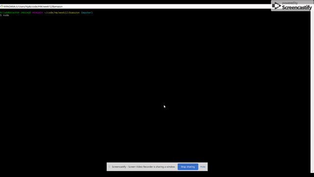

# Bamazon

An amazon-like shopping app made with MySQL and Node.JS which allow users to purchase items as a customer, view, track and update the product inventory as a manager.

## Bamazon Customer

To run app: enter into command line "node bamazonCustomer.js"

The Bamazon Customer Portal allows users to view the current items available for purchase. The user will be prompted to enter the item id and how many items they wish to purchase. If the item is in stock, the order will be completed and the user will see the total cost of their purchase.
The app will also updating the inventory after purchase. 

## Bamazon Manager 

To run app: enter into command line "node bamazonManager.js"

The Bamazon Customer Portal allows users to view and edit the inventory of the store. The user will be prompted to choose from the following options:

View products for sale
View low inventory
Add to inventory
Add a new product

**Deployed version of app:** (https://syeda-zaidi.github.io/Bamazon/)

**Developer :** Syeda H. Zaidi

